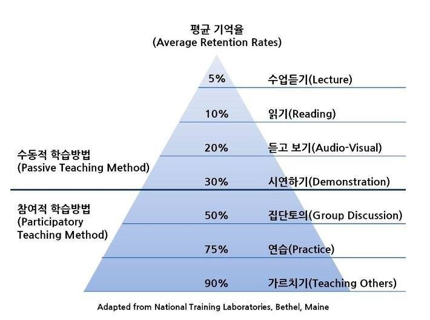

## 면담 및 오피스 아워를 위한 Zoom Link

+ 단축주소: https://seoultech.zoom.us/my/mksim
+ 회의실번호: 6490221641
+ 비밀번호: 355785
+ URL (비밀번호 입력 필요없음) https://seoultech.zoom.us/j/6490221641?pwd=c0RHaXlkMXRLU1h0WkZ0TWp6RVNqZz09

## Datacamp.com

+ 개요
    + Python, R, SQL등의 프로그래밍 언어를 interactive한 tutorial 형식으로 배울수 있는 사이트입니다.
    + 원래 유료이지만, 아래의 invitation link로 들어가서 @seoultech.ac.kr 계정을 사용하면 가입이 됩니다. 
    + https://www.datacamp.com/groups/shared_links/d44375b52cb17547bb7004f16631efae125ca21433b1940dfdb90837f36085db
    + 위의 링크는 2022년 봄학기에 해당합니다. 매년 3월과 9월에 계정이 만료됩니다. 그 때는 위의 링크를 클릭하고 다시 가입을 하면 됩니다. (위의 링크가 만료되었다면 연락 부탁드립니다.)

+ 추천 course
    + [Intro to Deep Learning] https://learn.datacamp.com/courses/introduction-to-deep-learning-with-keras
    + [Intro to R] https://learn.datacamp.com/courses/free-introduction-to-r
    + [Intermediate R] https://learn.datacamp.com/courses/intermediate-r
    + [Intro to tidyverse] https://learn.datacamp.com/courses/introduction-to-the-tidyverse
    + Intro to R/Intermediate R
    + Intro to Python/Intermediate Python
    + Supervise learning
    + Tidyverse 등

## Teaching Philosophy

### 학습 후 기억률

### 학습에 관한 파트 @ 소유냐 존재냐 (에리히 프롬, 정성환 옮김)

> 생존의 소유양식에 젖어 있는 학생들은 강의를 들을 때, 그 내용의 논리적 구조와 의미를 이해하기 위하여 귀를 기울이고, 가능한 한 그 말을 모두 노트에 적는다.  나중에는 적은 것을 암기하여 시험에 합격할 수도 있다.  그러나 그 내용은 그들 자신의 개인적인 사상체계의 일부가 되서 그들의 사고를 풍요하고 폭넓게 하지는 못한다.  그들은 강의의 내용을 사상 또는 전체적인 이론의 고정된 몇 가지 집합으로 변경시켜 저장한다.  학생들 각자가 남이 확인해 놓은 주장들 – 그 주장들이 진술자의 창의에서 나왔든 다른 원전에서 인용한 것이든 – 어떤 다름 사람에서 학생 개개인으로 바뀌었다는 사실을 제외하면, 학생들과 강의 내용은 여전히 서로 무관한 상태 그대로이다.

> 소유양식에 젖은 학생들은 단 한가지 목표밖에 가지고 있지 않다.  즉 배운 것을 잘 기억하거나 또는 노트를 소중히 간직함으로써 ‘배운 것’을 지키는 것이다.  그들은 어떤 새로운 것을 생산하거나 창조할 필요가 없다.

> 아니, ‘소유’형의 사람은 오히려 어떤 주제와 관한 새로운 사고나 개념에 대해 다소 당혹을 느낀다.  왜냐하면 새로운 것은 그들이 가지고 있는 일정한 양의 지식에 의혹을 만들기 때문이다.  실제로 소유를 세계와 관계를 맺는 주요한 형태로 파악하고 있는 사람에게는, 쉽게 고정될 수 없는 개념들은 성장하고 변화하며, 따라서 지배할 수 없는 다른 모든 것처럼 두려운 것이다.

> 세계와 존재양식으로 결부되어 있는 학생들에게 있어서 학습의 과정은 전혀 다른 성질을 가지고 있다.  무엇보다도 그들은 일련의 강의에, 비록 그것이 첫 강의라 할지라도 백지상태로는 참석하기 않는다.  그들은 그 강의에서 다루어질 문제를 미리 짐작하고 있으므로, 그들대로의 어떤 질문과 문제를 마음속에 간직한다.  그들은 강의의 주제에 완전히 몰두하게 되며, 또 흥미를 느낀다.

> 그들은 스스로가 말과 개념의 수동적인 저장소가 되는 대신에 귀를 기울이고 ‘듣고’, 그리고 이것이 가장 중요한 것이지만, 능동적이고 생산적인 방법으로 ‘받아들이고’ ‘반응한다’.  그들이 듣는 것은 그들 자신의 사고과정을 자극한다.  새로운 의문, 새로운 개념, 새로운 전망이 그들 마음속에 일어난다.  존재양식을 가진 학생들의 학습과정은 살아있는 과정이다.  그들은 관심을 가지고 귀를 기울이며, 교수가 강의하는 것을 들으며, 자발적으로 그들이 듣는 것에 응답하면서 생명을 얻는다.  그들은 집으로 가져가서 암기할 수 있는 지식을 습득하는 것은 아니다.  학생 개개인은 강의를 통하여 영향을 받고 변화하는 것이다.  강의를 들은 후에는, 강의를 듣기 전의 그들과는 다른 인간이 된다.  물론 이러한 학습양식은 강의가 적극적인 내용을 제공했을 때 비로소 가능하다.  존재양식에서 보면 공허한 이야기는 아무런 반응도 얻을 수 없으며, 그러한 경우 존재양식을 가지고 있는 학생들은 전혀 귀를 기울이지 않고 그들 자신의 사고과정에만 전념하는 것이 가장 좋은 태도임을 알고 있다.

### How can you tell if someone has a high IQ based on their behavior? - Brendan Kelly

https://www.quora.com/How-can-you-tell-if-someone-has-a-high-IQ-based-on-their-behavior

> usually open to discussing dispassionately, ideas that differ from their own and are slow to reach certainty on an issue.

> usually seeking information that disconfirms what they believe, rather than attempting to confirm their current beliefs.

> usually more interested in talking about ideas and concepts than gossiping about other people.

> willing to challenge beliefs commonly accepted by the group (tribe) to which they belong.

> likely to mistrust dogma and social norms, preferring to set their own standards of behavior and follow their own reasoned protocols.

> seldom aggressive in attempting to persuade others to their point of view, but passionate about the goals they wish to achieve.

> usually draw insightful inferences from their observations, identifying the essential elements in a clutter of information.

> interested in a very wide range of topics spanning the natural and social sciences as well the arts and almost anything of an academic nature. Their reading is scholarly, and they have little interest in tabloids.

> acutely aware of the limits of their knowledge.

